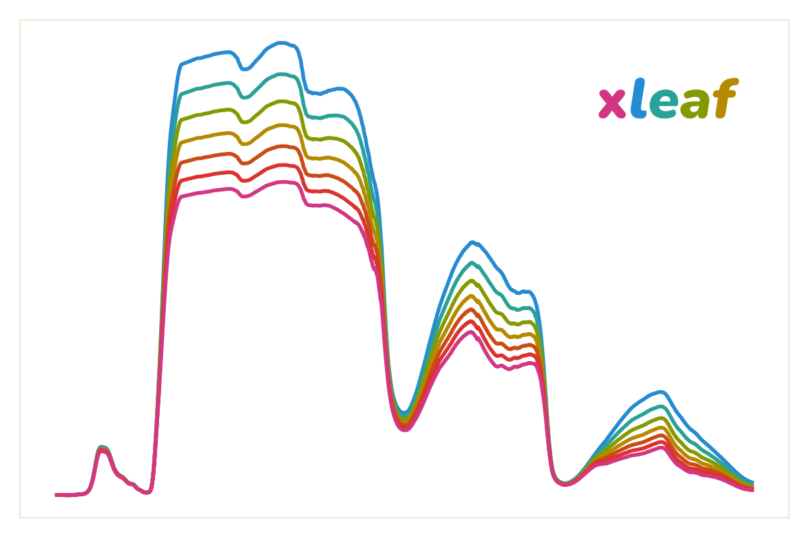

# xleaf



<p align="center">
    <em>Leaf and canopy radiative transfer modeling tools built on PROSPECT-D and SAIL.</em>
</p>

---

## Introduction

🌳 `xleaf` is a python package for running leaf and canopy simulation models using PROSAIL. It provides python bindings to the PROSPECT-D & 4SAIL [Fortran code](http://teledetection.ipgp.jussieu.fr/prosail/).

🌿 It includes sensible defaults that make it easy to get up and running quickly, and clear code documentation in the form of docstrings and type hints.

📚 All credit for the fundamental modeling code and for the underlying science belongs to the original researchers. `xleaf` is mostly a wrapper. Please see their most recent research:

```
@article{feret2017prospect,
  title={PROSPECT-D: Towards modeling leaf optical properties through a complete lifecycle},
  author={Feret, J-B and Gitelson, AA and Noble, SD and Jacquemoud, S},
  journal={Remote Sensing of Environment},
  volume={193},
  pages={204--215},
  year={2017},
  publisher={Elsevier}
}
```

🧙 Shout out to my man JB.

---

## Install

```
pip install xleaf
```

🖥️ Depending on your OS, you may need a FORTRAN compiler. So on ubuntu you could run `sudo apt install gcc`. On macos you'd run `brew install gcc`.

---

## Leaf and canopy simulations

```python
import xleaf
import matplotlib.pyplot as plt

# run with off-the-shelf defaults
leaf = xleaf.simulate_leaf()

# or specify detailed parameters
canopy = xleaf.simulate_canopy(
    chl = 40, # ug/cm2
    car = 8, # ug/cm2
    antho = 0.5, # ug/cm2
    ewt = 0.01, # cm
    lma = 0.009, # g/cm2
    N = 1.5, # unitless
    lai = 3.0, # m2/m2
    lidf = 30, # degrees
    soil_dryness = 0.75, # %
    solar_zenith = 35, # degrees
    solar_azimuth = 120, # degrees
    view_zenith = 0, # degrees
    view_azimuth = 60, # degrees
    hot_spot = 0.01, # unitless
)

# and plot them together
plt.plot(xleaf.wavelengths, leaf, label='leaf')
plt.plot(xleaf.wavelengths, canopy, label='canopy')
plt.legend()
```

📄 The definitions and expected range of values for each parameter are described in the `xleaf` docstrings.

---

## Random forests

📊 `xleaf` provides classes for generating random parameter values within the global range of expected values. These classes have a `.sample()` method for generating an appropriate random value for each parameter based on a literature review.

```python
import xleaf
import matplotlib.pyplot as plt

# generate 5 random leaf spectra from global defaults
for idx in range(5):
    chl = xleaf.ChlorophyllSampler.sample()
    car = xleaf.CarotenoidSampler.sample()
    antho = xleaf.AnthocyaninSampler.sample()
    ewt = xleaf.EWTSampler.sample()
    lma = xleaf.LMASampler.sample()
    N = xleaf.NSampler.sample()
    leaf = xleaf.simulate_leaf(chl, car, antho, ewt, lma, N)
    plt.plot(xleaf.wavelengths, leaf, label=f"leaf {idx+1}")

plt.legend()
```

🧪 Or experiment by setting the range of values yourself:

```python
import xleaf
import matplotlib.pyplot as plt

MyLAISampler = xleaf.UniformSampler(min=2, max=6)
MyVZASampler = xleaf.NormalSampler(mean=0, stdv=3, min=-10, max=10)

# generate 5 random canopy spectra just varying LAI/VZA
for idx in range(5):
    lai = MyLAISampler.sample()
    vza = MyVZASampler.sample()
    canopy = xleaf.simulate_canopy(lai=lai, view_zenith=vza)
    plt.plot(xleaf.wavelengths, canopy, label=f"lai: {lai:0.2f}, vza: {vza:0.2f}")

plt.legend()
```

⚡ These parameters don't always vary independently. Try to exercise caution when constructing parameter estimates to ensure biological realism.

---

## Developed by

[Christopher Anderson](https://cbanderson.info)[^1] [^2]

<a href="https://twitter.com/earth_chris"></a>
<a href="https://github.com/earth-chris"></a>

[^1]: [Planet Labs PBC, San Francisco](https://www.planet.com)
[^2]: [Center for Conservation Biology, Stanford University](https://ccb.stanford.edu)
